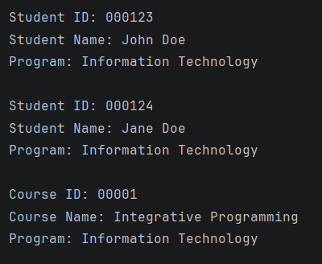
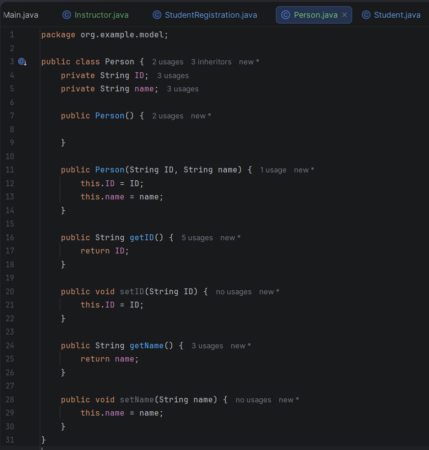
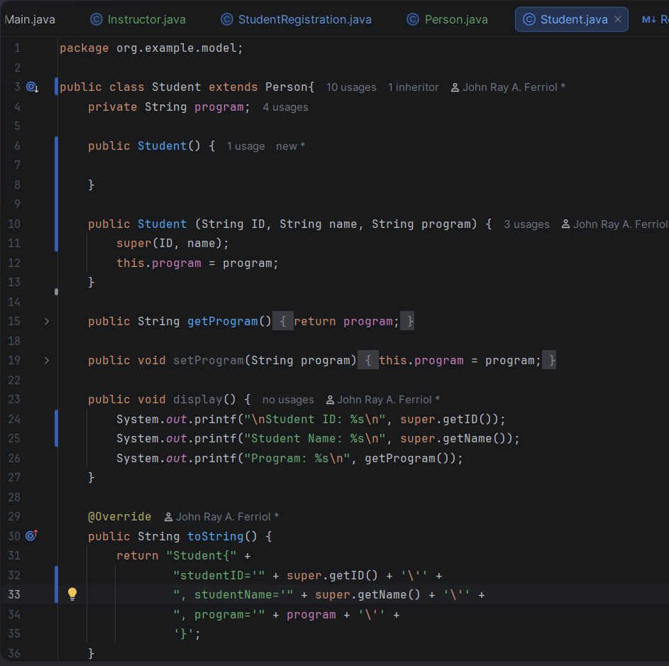
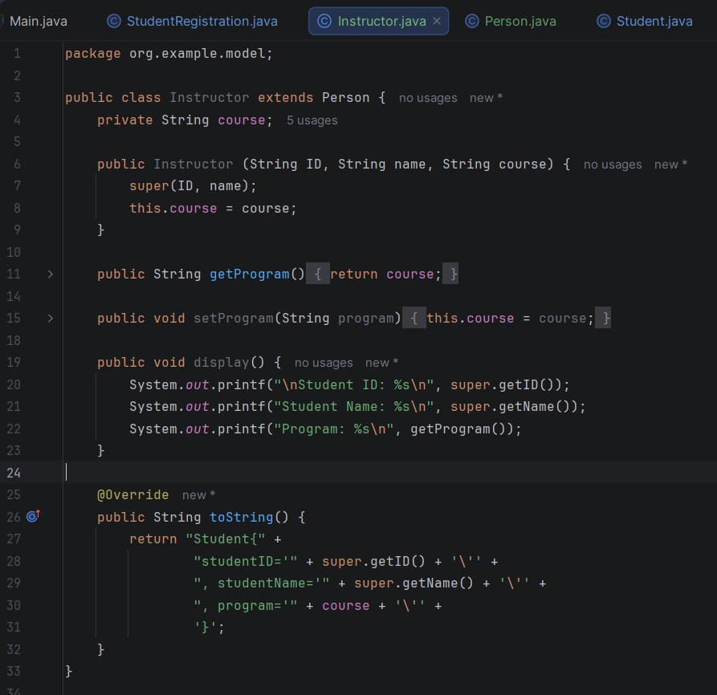
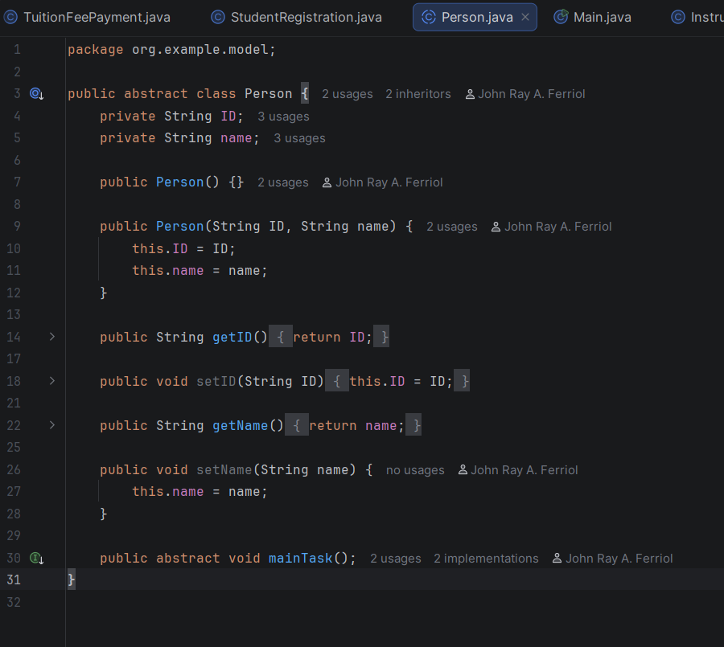
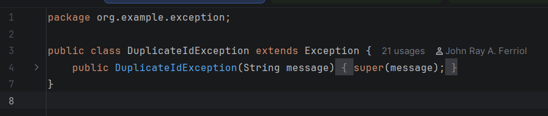
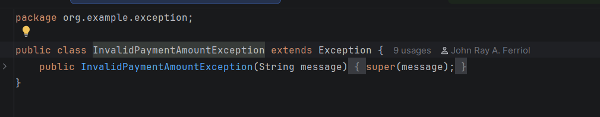
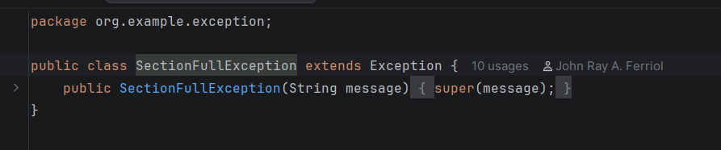
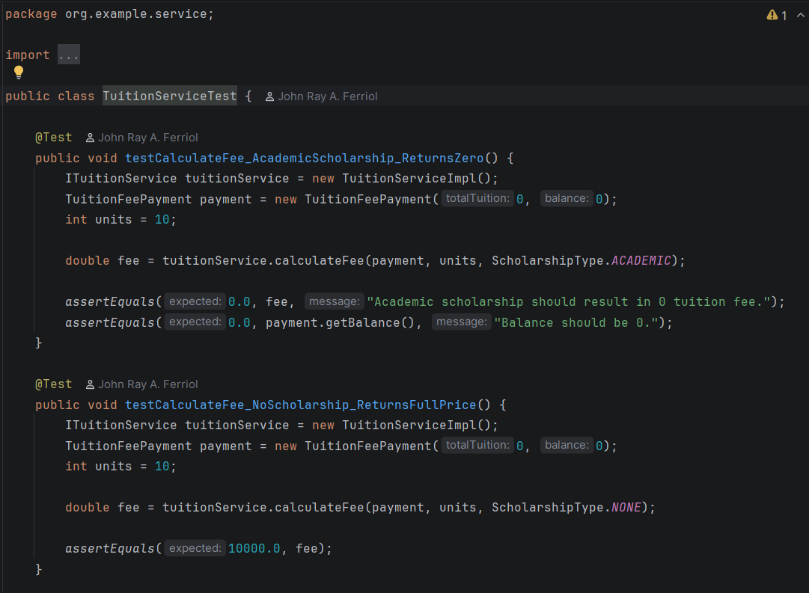

# OOP - Enrollment System
**Author**: John Ray A. Ferriol  

### 1. Encapsulation
Data integrity is maintained by keeping fields private and using getters/setters with validation.

---

### 2. Inheritance
The system uses inheritance to share common attributes across models and to implement a clean Service-Implementation architecture.

---

### 3. Abstraction

Abstraction is implemented through abstract classes that serve as templates for the system's core entities. This allows for the definition of common properties and behaviors while requiring specific details to be implemented by subclasses, streamlining the code structure.

---

**4. Interface**

The system follows an interface-driven architecture to decouple business logic from the implementation. Each service (Student, Instructor, Enrollment, etc.) has a dedicated interface defining its capabilities, ensuring flexibility and easier maintenance.

---

**5. Custom Exceptions**

To ensure a robust and error-free user experience, the system implements a custom exception hierarchy:
- `DuplicateIdException`: Prevents duplicate entries in the system.
- `SectionFullException`: Enforces capacity limits during enrollment.
- `InvalidPaymentAmountException`: Validates financial transactions.

---

**6. Unit Testing with JUnit Test**

Reliability is verified through automated unit tests using JUnit 5. These tests cover critical business logic, including tuition calculations, enrollment validation, and duplicate prevention, ensuring the system remains stable as it evolves.

